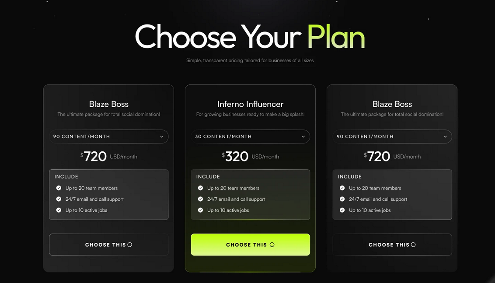
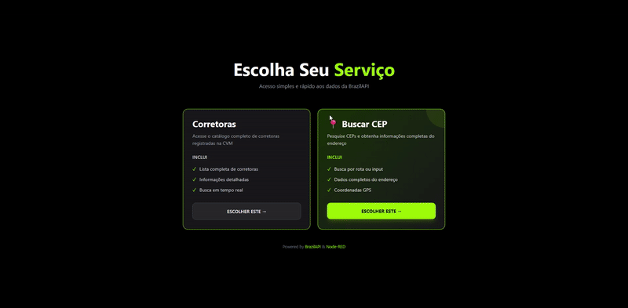
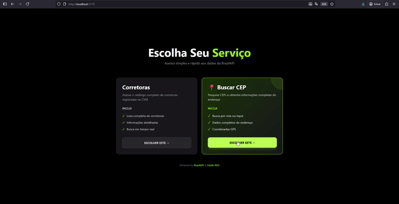
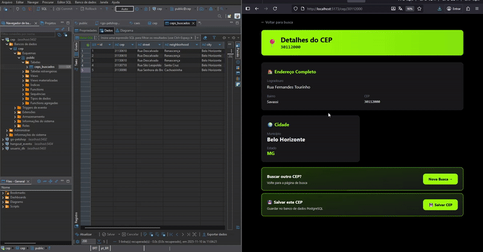
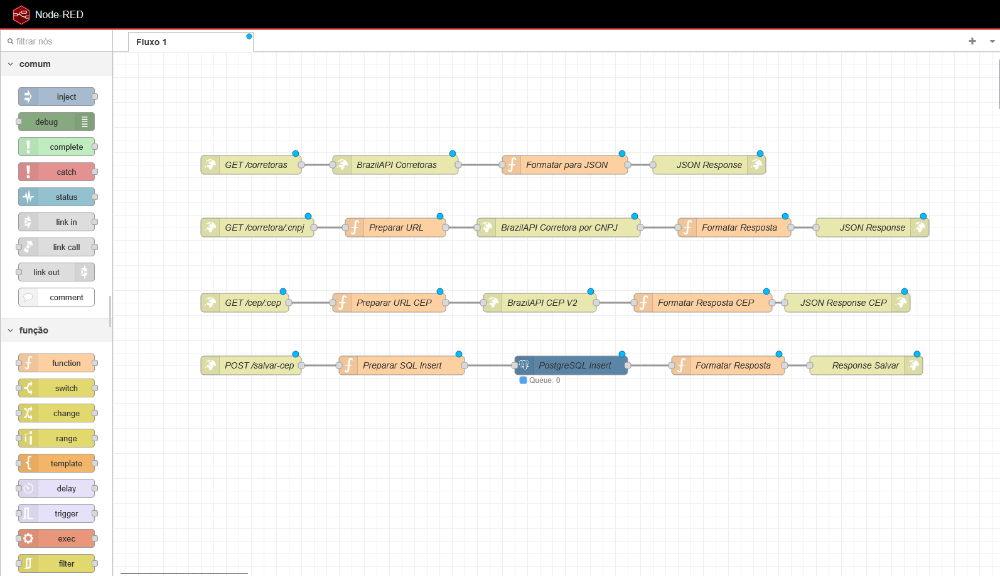

## 📡 API Endpoints

Node-RED provides the following endpoints:

| Method | Endpoint | Description |
|--------|----------|-------------|
| GET | `/corretoras` | List all brokers |
| GET | `/corretora/:cnpj` | Get broker details by CNPJ |
| GET | `/cep/:cep` | Get CEP details |
| POST | `/salvar-cep` | Save CEP to database |

## 🏗️ Project Structure
```
├── buscador-nodered/   # Frontend application
│   ├── src/
│   │   ├── pages/      # React pages
│   │   ├── services/   # API services
│   │   └── types/      # TypeScript types
│   └── package.json
```

## 🎯 Features

### Broker Catalog
- ✅ List all CVM registered brokers
- ✅ Display format: `"${Name} - ${City} / ${CNPJ}"`
- ✅ Click to view detailed information

### CEP Finder
- ✅ **Option 1**: Search via route parameter (`/cep/89010025`)
- ✅ **Option 2**: Search via input field
- ✅ Save searches to PostgreSQL database


## 🎨 Design Inspiration  
  
The frontend design was inspired by Adapting its visual elements and user experience patterns to create a clean and intuitive interface for the broker catalog and CEP finder features.

## Test  
  
### Broker Catalog Functionality  
Browse through all CVM registered brokers and view detailed information by clicking on any broker from the list.  
  
  
  
### CEP Search Functionality  
Search for Brazilian postal codes (CEP) using either the input field or direct URL parameter, with results displayed instantly.  
  
  
  
### Database Integration  
CEP searches are automatically saved to the PostgreSQL database, demonstrating the complete data persistence flow.  
  


## NODE-RED
Visual representation of the Node-RED flows handling API endpoints, data processing, and database operations.
